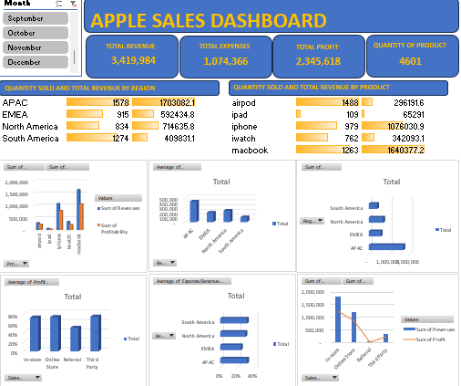

# 📊 Apple 2022 Sales Performance Analysis

This project presents an in-depth analysis of Apple's 2022 sales data to uncover insights into product performance, regional profitability, and operational efficiency. Built with Excel, this dashboard delivers clear visuals and actionable insights for business stakeholders.

---

## 🔍 Executive Summary

**🎯 Objective:**  
Analyze sales performance, profitability, and efficiency across regions and products.

**📌 Key Insights:**
- 📱 iPhone is the top-performing product by both revenue and profit.
- 🌎 North America leads in revenue and average transaction value.
- 🏬 Retail stores are the most profitable sales channel.
- 📦 Quantity sold correlates with revenue for products, but not across regions.
- 🌍 EMEA has the highest expense-to-revenue ratio.

**🛠 Recommendations:**
- Prioritize marketing and inventory strategies for iPhones.
- Expand North American strategies to other regions.
- Reduce operational costs in EMEA through auditing and streamlining.

---

## 🧭 Business Context

**Background:**  
Apple seeks to refine its regional strategies and product focus based on full-year 2022 sales performance.

**Stakeholders:**  
Sales leadership, regional managers, marketing, and finance teams.

**Key Business Questions:**
- Which product is most profitable?
- Which region performs best overall?
- Which sales channel yields the best ROI?
- Does sales volume directly drive revenue?
- Where are operational costs disproportionately high?

---

## 🗂️ Data Overview

- **📁 Source:** Internal sales database
- **📅 Date Range:** January – December 2022
- **🔢 Fields Used:** Product, Region, Sales Method, Revenue, Price Per Unit, Cost Per Unit, Quantity Sold
- **✅ Data Quality:** Clean dataset with complete yearly coverage; no visible issues noted.

---

## 📊 Dashboard Overview
> 

**Tool Used:** Microsoft Excel

### 🖼️ Key Visualizations:
- **Revenue by Region:** Identifies top and bottom-performing regions.
- **Product Performance:** Displays quantity sold and revenue by SKU.
- **Profit by Product:** Highlights profit contribution per product.
- **Sales Method Comparison:** Evaluates revenue and profit by channel (e.g., retail vs. online).
- **Expense Analysis:** Assesses efficiency by comparing expenses to revenue across regions.

## 💡 Final Recommendations

- Invest further in the iPhone line to maximize profit.
- Scale North America's high-value strategies to other regions.
- Investigate and reduce expenses in the EMEA region to improve margins.

---

## 🧠 Tools & Skills Demonstrated

- Microsoft Excel (PivotTables, Charts, Dashboards)
- Business Intelligence & Reporting
- Exploratory Data Analysis (EDA)
- Strategic Insight Communication
- Data Cleaning & Transformation

---

## 📁 Files

- `Apple_2022_Sales_Analysis_Report.pdf` – Executive summary and visuals
- `Excel_Dashboard.xlsx` – Interactive dashboard with visual insights

---

## 🙋‍♂️ About Me

**Oluwatobi Titilayo**  
Data Analyst | Excel • Python • SQL • Power BI  
[LinkedIn](https://www.linkedin.com/in/titilayo-oluwatobi/) | [GitHub](https://github.com/Oluwatobi-Data)

---

> “Without data, you’re just another person with an opinion.” – W. Edwards Deming
